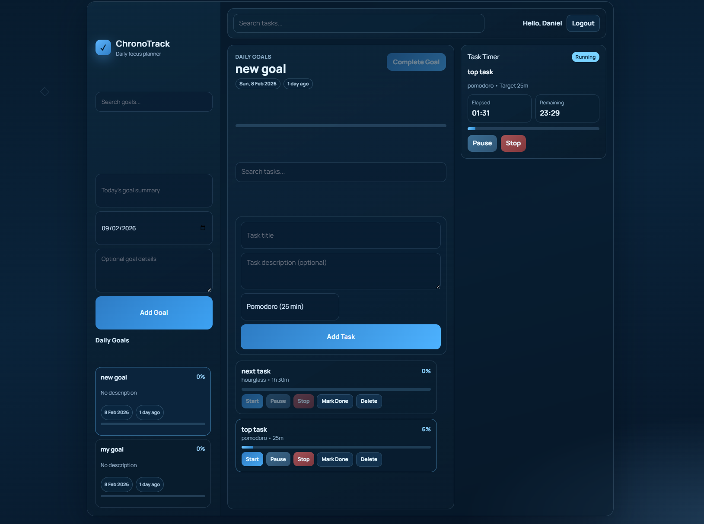

# ChronoTrack

ChronoTrack is a daily planning and time-tracking app built on Laravel + Vue.



## Features
- Daily goals workflow: create, list, view, progress, complete.
- Task workflow inside goals: create, list, show, update, delete.
- Timer workflow per task: start, pause, stop, active timer lookup.
- Timer profiles:
  - `pomodoro` (fixed 25 minutes)
  - `custom` (1..720 minutes)
  - `hourglass` presets (60, 90, 120, 240)
- Single running timer invariant per user.
- Idempotent timer stop support.
- Live dashboard timer/progress updates (frontend 1s tick, progress step updates).

## API Docs
- Swagger UI (running app): [http://localhost:8000/api/docs](http://localhost:8000/api/docs)
- OpenAPI spec file: [`public/docs/openapi.yaml`](public/docs/openapi.yaml)

## Local setup

```bash
git clone https://github.com/DannyS95/chronotrack.git
cd chronotrack
make up
make install
make dev
```

## Notes
- API uses Sanctum auth.
- Internal architecture/context notes are kept in a local-only `README_ARCHITECTURE.md`.
